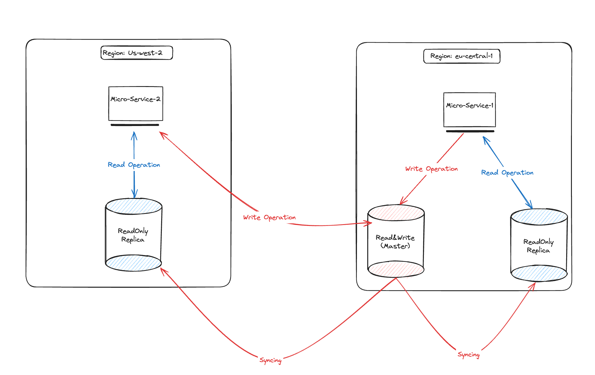

# DBRouter:

DB Connection Router for cross-region databases, separating the ReadOnly and ReadAndWrite databases based on connection requirements.

## Idea and Inspirations:
The DBRouter library manages your database connections by directing them to the appropriate databases. 
For instance, all `SELECT` queries are sent to the ReadOnly (Slave) replica database, while all write operations (`INSERT`, `UPDATE`, `DELETE`) are sent to the WriteAndRead (Master) database.

#### Checkout Picture:-

## Instructions:
### Download
`go get -u github.com/tz3/dbrouter`

## Contribution:
To contribute you can Open PR/Issue with its corresponding details.